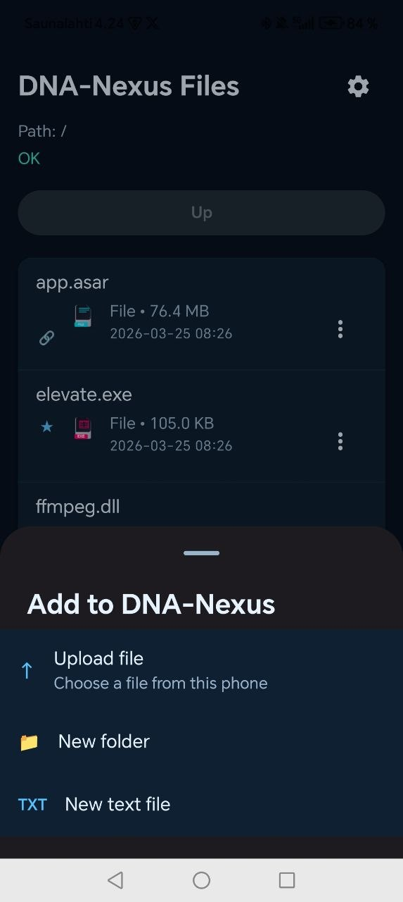
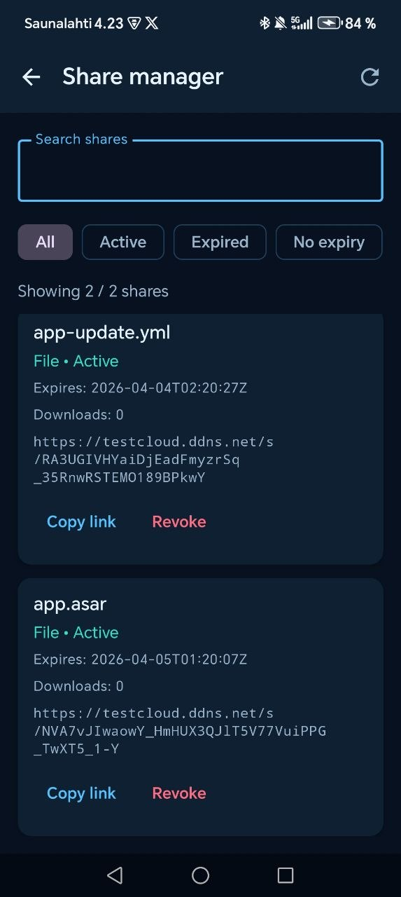

# DNA-Nexus

DNA-Nexus is a private cloud and file access app for your own DNA-Nexus server.

This Android app lets you browse files, upload content, manage shares, preview images, edit text files, and monitor your storage usage from your phone.

## Screenshots

<p align="center">
  
  
</p>

## Features

- Browse files and folders
- Upload files from your phone
- Download files
- Create public share links
- Choose share expiry:
  - 1 hour
  - 1 day
  - 7 days
  - never
- Manage shares in the app
- Add and remove favorites
- Preview images
- Edit text files directly on the server
- View storage quota and usage

## Project status

DNA-Nexus is under active development.

Current focus areas include:

- improving mobile UX
- expanding file management
- improving share handling
- polishing server and app integration

## Tech

- Kotlin
- Jetpack Compose
- Retrofit
- Android Studio

## Development

Open the project in Android Studio and build the debug version:

```bash
./gradlew :app:assembleDebug
